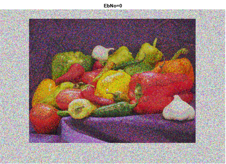
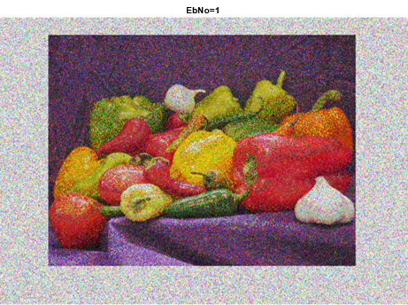
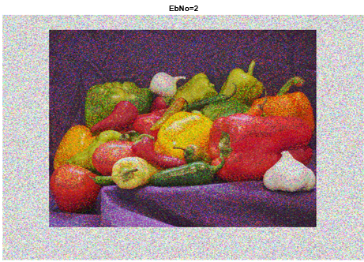
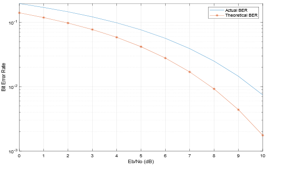

# Purpose
This is a matlab code is intended to simulate image transmission over 16-QAM over Additive White Gaussian Noise.

The simulation is carried over Experimental bit error rate (BER) for 10 values of (Eb/N0) from zero to ten 

The output is several windows of the image recieved and the output graph of the BER over the ten values of (Eb/No) as shown below

#### Transmited Image

#### Output Image 
The outputed images are recieved after transmission. The label at the top Shows the value of Eb/No over which the image was transmmited. Below are sample outputs. 

 

#### Output Graph

 
# Requirements
 
* The code was writen using Matlab 2020Ra software

# Usage
  To run the matlab file place the image "pappers.png" in the same directory as the matlab code and open the file in matlab.

  To understand the functionality, please read the comments in the code